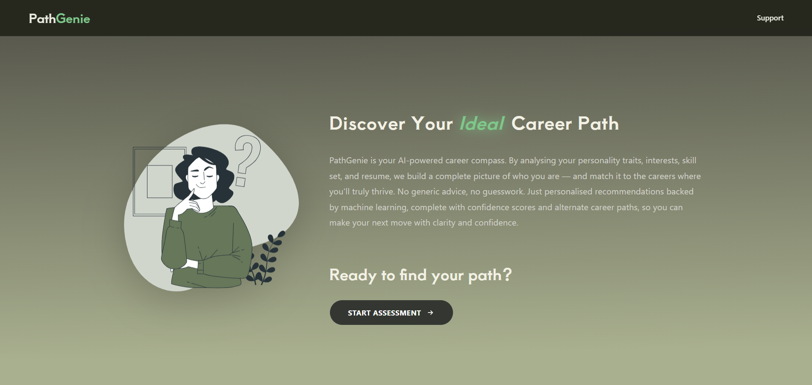
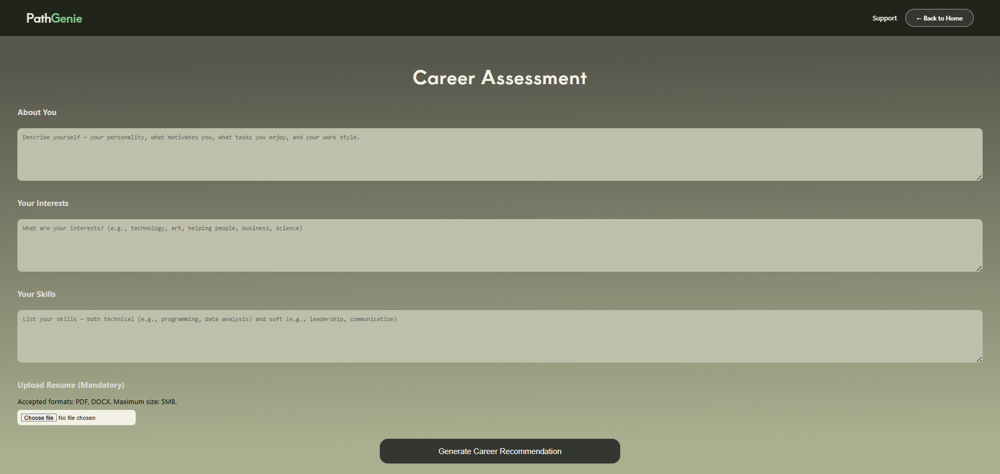
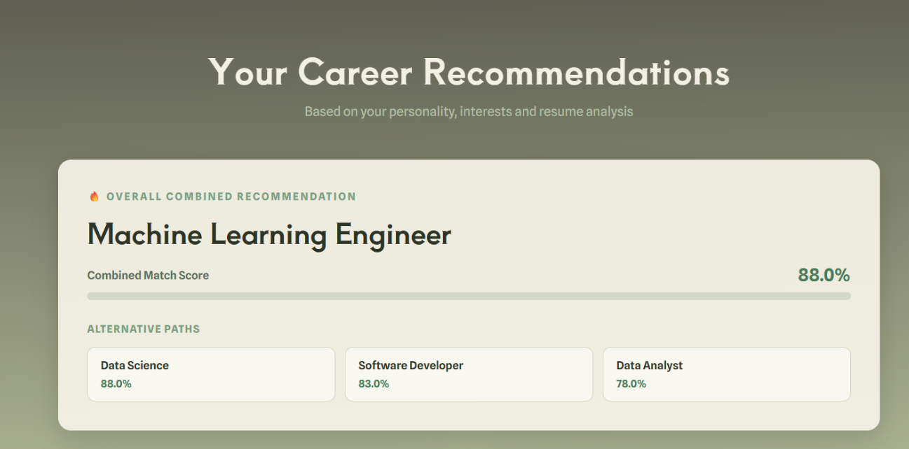

## PathGenie

AI-powered career recommendation web app using machine learning and NLP.

---

### Features

* Personalized career recommendations based on user input
* Logistic Regression + NLP classifier
* Fast predictions (sub-second response time)
* Responsive multi-page web interface

---

### Tech Stack

* Python
* Flask
* Scikit-learn
* HTML, CSS, JavaScript

---

### Performance

* Accuracy: **80–90%**
* Response Time: **< 1 second**
* TF-IDF reduced dimensionality by **70%+**

---

## Screenshots

### Landing Page

### Assessment Page

### Recommendation Result

---

### Overview

PathGenie analyzes user inputs such as interests, skills, and preferences, processes text data using TF-IDF, and applies machine learning models to recommend suitable career paths in real time.
